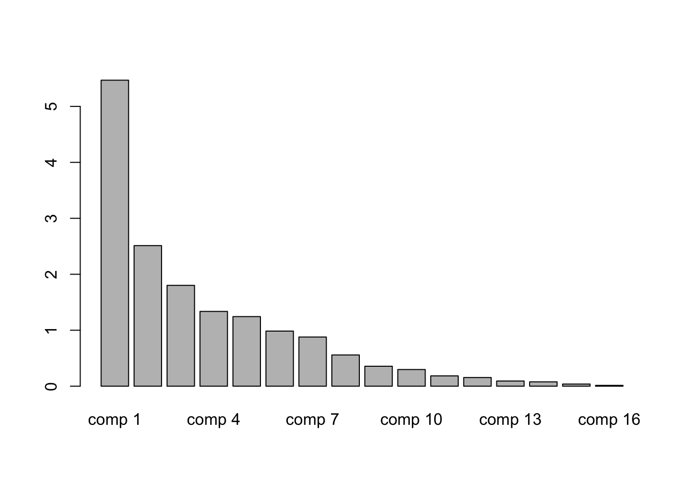
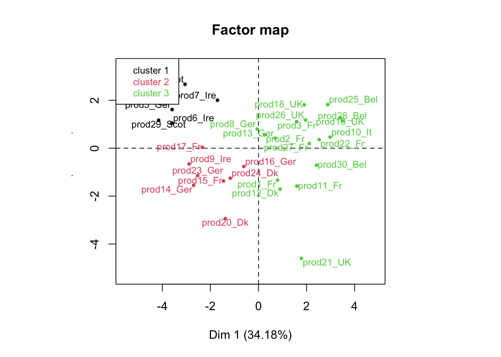
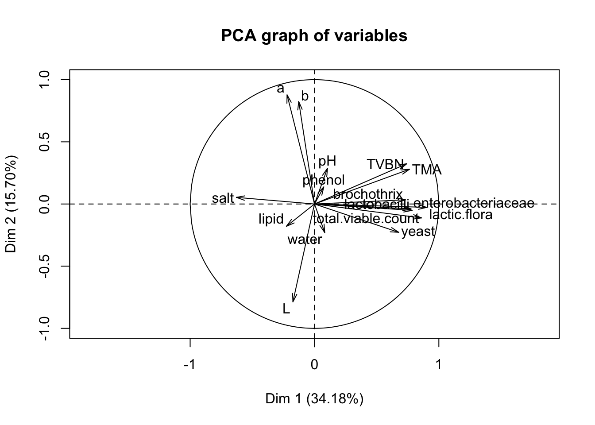

# Understanding the data from a product perspective
## Understanding the products from a chemical and physical point of view
### Let's first have a look at the data

In the following code, we first import the data with the **read.table** function, then we use the **head** function in order to have a look at the dataset; finally we make a summary of the dataset with the **summary** function. All these steps are really important when you begin you analysis.


```r
salmon_car <- read.table("Salmon_characteristics.txt", header=TRUE, row.names=1,
                         dec=",", sep="\t")
head(salmon_car)
```

```
##              water   lipid    TVBN     TMA    salt  phenol      pH
## prod1_Fr   -0.8644  1.1375 -0.7629 -0.8717 -0.1471 -0.3776  1.5412
## prod2_Fr   -1.1476  0.7036  0.2357  0.3204  0.1626  0.0112  1.2098
## prod3_Fr   -0.4172  0.3378  0.4354  1.2144  0.3174  0.4001  0.3812
## prod4_Scot -0.8147 -0.0961 -0.5632 -0.8717  0.3174 -0.4554  0.2154
## prod5_Ger  -1.6991  0.0366 -0.7629 -0.8717  2.1752 -0.3776 -0.2817
## prod6_Ire  -0.9886  0.9653 -0.7629 -0.8717  0.0077  0.6594  1.0441
##            total.viable.count lactic.flora lactobacilli brochothrix   yeast
## prod1_Fr               0.1112       0.6665       1.1382      0.5461  0.7729
## prod2_Fr               0.4302      -0.4514       0.1290     -0.7559  1.2034
## prod3_Fr               0.8225       0.8725       0.4088      0.6465  0.2875
## prod4_Scot            -0.2432      -1.5861      -1.0624     -0.7559 -1.0340
## prod5_Ger             -1.5584      -1.5861      -1.0624     -0.7559 -1.0340
## prod6_Ire             -2.5977      -1.5861      -1.0624     -0.7559 -1.0340
##            enterobacteriaceae       L       a       b   origin
## prod1_Fr               0.8314  0.9917 -0.6467 -0.4567   France
## prod2_Fr               0.5998  0.8542  0.5297  0.9551   France
## prod3_Fr               0.2524 -0.8548  0.3927  0.2813   France
## prod4_Scot            -1.5793  0.3020  1.7439  3.3236 Scotland
## prod5_Ger             -0.9582 -1.3485  0.7341  0.5485  Germany
## prod6_Ire             -1.5793 -0.4322  0.4016  0.4278  Ireland
```

```r
summary(salmon_car)
```

```
##      water              lipid                 TVBN              TMA            
##  Min.   :-1.69910   Min.   :-2.4628000   Min.   :-1.1623   Min.   :-0.8717000  
##  1st Qu.:-0.85198   1st Qu.:-0.4259750   1st Qu.:-0.7629   1st Qu.:-0.8717000  
##  Median :-0.07435   Median : 0.2159000   Median :-0.3635   Median :-0.2757000  
##  Mean   :-0.00001   Mean   : 0.0000067   Mean   : 0.0000   Mean   : 0.0000033  
##  3rd Qu.: 0.47713   3rd Qu.: 0.5763000   3rd Qu.: 0.4354   3rd Qu.: 0.5439000  
##  Max.   : 2.02730   Max.   : 1.6251000   Max.   : 2.6322   Max.   : 2.4065000  
##       salt             phenol               pH             total.viable.count  
##  Min.   :-2.0049   Min.   :-1.20730   Min.   :-1.7733000   Min.   :-2.5977000  
##  1st Qu.:-0.6115   1st Qu.:-0.65633   1st Qu.:-0.8617500   1st Qu.:-0.3530250  
##  Median : 0.0077   Median :-0.29985   Median :-0.0331500   Median : 0.2699000  
##  Mean   : 0.0000   Mean   : 0.00001   Mean   :-0.0000067   Mean   : 0.0000067  
##  3rd Qu.: 0.3174   3rd Qu.: 0.40010   3rd Qu.: 0.8368750   3rd Qu.: 0.8187750  
##  Max.   : 2.4848   Max.   : 3.45930   Max.   : 2.0384000   Max.   : 1.1384000  
##   lactic.flora         lactobacilli         brochothrix     
##  Min.   :-1.5861000   Min.   :-1.0624000   Min.   :-0.7559  
##  1st Qu.:-0.4710500   1st Qu.:-1.0624000   1st Qu.:-0.7559  
##  Median : 0.3886500   Median : 0.2064500   Median :-0.7559  
##  Mean   : 0.0000033   Mean   :-0.0000067   Mean   : 0.0000  
##  3rd Qu.: 0.8312750   3rd Qu.: 0.9333500   3rd Qu.: 0.8192  
##  Max.   : 1.5327000   Max.   : 1.9639000   Max.   : 2.4632  
##      yeast            enterobacteriaceae       L                 a          
##  Min.   :-1.0340000   Min.   :-1.57930   Min.   :-1.8353   Min.   :-3.9939  
##  1st Qu.:-1.0340000   1st Qu.:-0.65815   1st Qu.:-0.8034   1st Qu.:-0.4152  
##  Median : 0.2608000   Median : 0.04190   Median : 0.1441   Median : 0.2868  
##  Mean   : 0.0000033   Mean   :-0.00001   Mean   : 0.0000   Mean   : 0.0000  
##  3rd Qu.: 0.7537750   3rd Qu.: 0.79060   3rd Qu.: 0.5455   3rd Qu.: 0.5362  
##  Max.   : 2.1072000   Max.   : 1.64720   Max.   : 2.5982   Max.   : 1.7439  
##        b                origin         
##  Min.   :-1.827700   Length:30         
##  1st Qu.:-0.577750   Class :character  
##  Median : 0.073650   Mode  :character  
##  Mean   :-0.000003                     
##  3rd Qu.: 0.388475                     
##  Max.   : 3.323600
```

```r
class(salmon_car$origin)
```

```
## [1] "character"
```

The **summary** function as well as the **class** function show that the class of last variable *origin* is "character". If you want to know more about this class, please refer to this [link](https://www.r-bloggers.com/character-strings-in-r/). Let's transform this variable into a factor. To do so, we use the **as.factor** function.


```r
salmon_car$origin <- as.factor(salmon_car$origin)
```

Let's now run the **summary** function again to see what has changed.


```r
summary(salmon_car)
```

```
##      water              lipid                 TVBN              TMA            
##  Min.   :-1.69910   Min.   :-2.4628000   Min.   :-1.1623   Min.   :-0.8717000  
##  1st Qu.:-0.85198   1st Qu.:-0.4259750   1st Qu.:-0.7629   1st Qu.:-0.8717000  
##  Median :-0.07435   Median : 0.2159000   Median :-0.3635   Median :-0.2757000  
##  Mean   :-0.00001   Mean   : 0.0000067   Mean   : 0.0000   Mean   : 0.0000033  
##  3rd Qu.: 0.47713   3rd Qu.: 0.5763000   3rd Qu.: 0.4354   3rd Qu.: 0.5439000  
##  Max.   : 2.02730   Max.   : 1.6251000   Max.   : 2.6322   Max.   : 2.4065000  
##                                                                                
##       salt             phenol               pH             total.viable.count  
##  Min.   :-2.0049   Min.   :-1.20730   Min.   :-1.7733000   Min.   :-2.5977000  
##  1st Qu.:-0.6115   1st Qu.:-0.65633   1st Qu.:-0.8617500   1st Qu.:-0.3530250  
##  Median : 0.0077   Median :-0.29985   Median :-0.0331500   Median : 0.2699000  
##  Mean   : 0.0000   Mean   : 0.00001   Mean   :-0.0000067   Mean   : 0.0000067  
##  3rd Qu.: 0.3174   3rd Qu.: 0.40010   3rd Qu.: 0.8368750   3rd Qu.: 0.8187750  
##  Max.   : 2.4848   Max.   : 3.45930   Max.   : 2.0384000   Max.   : 1.1384000  
##                                                                                
##   lactic.flora         lactobacilli         brochothrix     
##  Min.   :-1.5861000   Min.   :-1.0624000   Min.   :-0.7559  
##  1st Qu.:-0.4710500   1st Qu.:-1.0624000   1st Qu.:-0.7559  
##  Median : 0.3886500   Median : 0.2064500   Median :-0.7559  
##  Mean   : 0.0000033   Mean   :-0.0000067   Mean   : 0.0000  
##  3rd Qu.: 0.8312750   3rd Qu.: 0.9333500   3rd Qu.: 0.8192  
##  Max.   : 1.5327000   Max.   : 1.9639000   Max.   : 2.4632  
##                                                             
##      yeast            enterobacteriaceae       L                 a          
##  Min.   :-1.0340000   Min.   :-1.57930   Min.   :-1.8353   Min.   :-3.9939  
##  1st Qu.:-1.0340000   1st Qu.:-0.65815   1st Qu.:-0.8034   1st Qu.:-0.4152  
##  Median : 0.2608000   Median : 0.04190   Median : 0.1441   Median : 0.2868  
##  Mean   : 0.0000033   Mean   :-0.00001   Mean   : 0.0000   Mean   : 0.0000  
##  3rd Qu.: 0.7537750   3rd Qu.: 0.79060   3rd Qu.: 0.5455   3rd Qu.: 0.5362  
##  Max.   : 2.1072000   Max.   : 1.64720   Max.   : 2.5982   Max.   : 1.7439  
##                                                                             
##        b                 origin 
##  Min.   :-1.827700   France :8  
##  1st Qu.:-0.577750   Germany:6  
##  Median : 0.073650   UK     :4  
##  Mean   :-0.000003   Belgium:3  
##  3rd Qu.: 0.388475   DK     :3  
##  Max.   : 3.323600   Ireland:3  
##                      (Other):3
```

The *origin* variable is considered as a factor; we can have a look at its levels with the **levels** function.


```r
levels(salmon_car$origin)
```

```
## [1] "Belgium"  "DK"       "France"   "Germany"  "Ireland"  "Italy"    "Scotland"
## [8] "UK"
```


As you can see in the output, something is missing in the description of the variable *origin*. By default, the numbers of levels to be displayed is equal to 7. Let's set the argument *maxsum* to 8 and see what happens. 


```r
summary(salmon_car,maxsum=8)
```

```
##      water              lipid                 TVBN              TMA            
##  Min.   :-1.69910   Min.   :-2.4628000   Min.   :-1.1623   Min.   :-0.8717000  
##  1st Qu.:-0.85198   1st Qu.:-0.4259750   1st Qu.:-0.7629   1st Qu.:-0.8717000  
##  Median :-0.07435   Median : 0.2159000   Median :-0.3635   Median :-0.2757000  
##  Mean   :-0.00001   Mean   : 0.0000067   Mean   : 0.0000   Mean   : 0.0000033  
##  3rd Qu.: 0.47713   3rd Qu.: 0.5763000   3rd Qu.: 0.4354   3rd Qu.: 0.5439000  
##  Max.   : 2.02730   Max.   : 1.6251000   Max.   : 2.6322   Max.   : 2.4065000  
##                                                                                
##                                                                                
##       salt             phenol               pH             total.viable.count  
##  Min.   :-2.0049   Min.   :-1.20730   Min.   :-1.7733000   Min.   :-2.5977000  
##  1st Qu.:-0.6115   1st Qu.:-0.65633   1st Qu.:-0.8617500   1st Qu.:-0.3530250  
##  Median : 0.0077   Median :-0.29985   Median :-0.0331500   Median : 0.2699000  
##  Mean   : 0.0000   Mean   : 0.00001   Mean   :-0.0000067   Mean   : 0.0000067  
##  3rd Qu.: 0.3174   3rd Qu.: 0.40010   3rd Qu.: 0.8368750   3rd Qu.: 0.8187750  
##  Max.   : 2.4848   Max.   : 3.45930   Max.   : 2.0384000   Max.   : 1.1384000  
##                                                                                
##                                                                                
##   lactic.flora         lactobacilli         brochothrix     
##  Min.   :-1.5861000   Min.   :-1.0624000   Min.   :-0.7559  
##  1st Qu.:-0.4710500   1st Qu.:-1.0624000   1st Qu.:-0.7559  
##  Median : 0.3886500   Median : 0.2064500   Median :-0.7559  
##  Mean   : 0.0000033   Mean   :-0.0000067   Mean   : 0.0000  
##  3rd Qu.: 0.8312750   3rd Qu.: 0.9333500   3rd Qu.: 0.8192  
##  Max.   : 1.5327000   Max.   : 1.9639000   Max.   : 2.4632  
##                                                             
##                                                             
##      yeast            enterobacteriaceae       L                 a          
##  Min.   :-1.0340000   Min.   :-1.57930   Min.   :-1.8353   Min.   :-3.9939  
##  1st Qu.:-1.0340000   1st Qu.:-0.65815   1st Qu.:-0.8034   1st Qu.:-0.4152  
##  Median : 0.2608000   Median : 0.04190   Median : 0.1441   Median : 0.2868  
##  Mean   : 0.0000033   Mean   :-0.00001   Mean   : 0.0000   Mean   : 0.0000  
##  3rd Qu.: 0.7537750   3rd Qu.: 0.79060   3rd Qu.: 0.5455   3rd Qu.: 0.5362  
##  Max.   : 2.1072000   Max.   : 1.64720   Max.   : 2.5982   Max.   : 1.7439  
##                                                                             
##                                                                             
##        b                  origin 
##  Min.   :-1.827700   Belgium :3  
##  1st Qu.:-0.577750   DK      :3  
##  Median : 0.073650   France  :8  
##  Mean   :-0.000003   Germany :6  
##  3rd Qu.: 0.388475   Ireland :3  
##  Max.   : 3.323600   Italy   :1  
##                      Scotland:2  
##                      UK      :4
```

Now we want to get a multivariate description of the smoked salmons based on their chemical and physical measurements. As all the measures (except *origin*) are continuous, we're going to run a PCA on the dataset. It seems fair to consider all the variables as *active*, and to scale them to unit variance. Here, the last variable *origin* is considered as *illustrative*.

To do so, we are using the **FactoMineR** package and the **PCA** function. First, load the **FactoMineR** package and run the **PCA** function.


```r
library(FactoMineR)
res <- PCA(salmon_car,quali.sup=17,graph=F)
names(res)
```

```
## [1] "eig"       "var"       "ind"       "svd"       "quali.sup" "call"
```

When you run a PCA, you often want to save the results in an R object, in order to use them latter. This is what we did: we saved them in an object we named *res*, then we applied the **names** function to that object. This function allows you to obtain the names of the different components of the input. For instance, if you want to see of the variance is decomposed:


```r
res$eig
```

```
##         eigenvalue percentage of variance cumulative percentage of variance
## comp 1  5.46821199            34.17632493                          34.17632
## comp 2  2.51222592            15.70141202                          49.87774
## comp 3  1.80173714            11.26085714                          61.13859
## comp 4  1.33622262             8.35139136                          69.48999
## comp 5  1.24367295             7.77295594                          77.26294
## comp 6  0.98474448             6.15465300                          83.41759
## comp 7  0.87880761             5.49254757                          88.91014
## comp 8  0.55820900             3.48880625                          92.39895
## comp 9  0.35637332             2.22733324                          94.62628
## comp 10 0.29787183             1.86169893                          96.48798
## comp 11 0.18417610             1.15110061                          97.63908
## comp 12 0.15473811             0.96711318                          98.60619
## comp 13 0.09236742             0.57729636                          99.18349
## comp 14 0.07795966             0.48724787                          99.67074
## comp 15 0.03834453             0.23965332                          99.91039
## comp 16 0.01433732             0.08960828                         100.00000
```

```r
barplot(res$eig[,1])
```



Now, let's see what happens if we run the **plot.PCA** function to the *res* object.


```r
plot.PCA(res,choix="var")
```


```r
plot.PCA(res,choix="ind")
```


```r
plot.PCA(res,choix="ind",invisible="quali")
```


As you can see, some news feature have been added to the **FactoMineR** package, notably the *ggplot* type representation of the individuals and the variables. In this example, we can see how important *supplementary* variables can be. We can also see how they can be represented, which is the case by default. Here, we projected the information on the origin of the smoked salmon. Look at the product 10, how do you think this product is salty?

Any questions about the concept of *illustrative* variables? What do you think about the percentage associated with each axis?

Now that we know how to differentiate *illustrative* or *supplementary* variables from the *active* ones, let's spend some time to interpret this PCA. As you know, the two graphical representations have to be interpreted jointly.

You may want to use the **dimdesc** function to get an interpretation of the axis.


```r
resdim <- dimdesc(res)
names(resdim)
```

```
## [1] "Dim.1" "Dim.2" "Dim.3" "call"
```

```r
resdim$Dim.1
```

```
## $quanti
##                    correlation      p.value
## lactic.flora         0.9027708 9.041485e-12
## total.viable.count   0.8608419 1.046362e-09
## lactobacilli         0.7850662 2.795050e-07
## enterobacteriaceae   0.7762724 4.619296e-07
## TMA                  0.7642286 8.873792e-07
## TVBN                 0.7421954 2.668420e-06
## brochothrix          0.7317464 4.332436e-06
## yeast                0.6773779 3.930677e-05
## salt                -0.6282864 2.011201e-04
## 
## $quali
##               R2      p.value
## origin 0.7348005 3.964817e-05
## 
## $category
##                  Estimate    p.value
## origin=Belgium   2.871677 0.02182312
## origin=UK        2.208683 0.03851838
## origin=Ireland  -2.788912 0.03325308
## origin=Scotland -3.662799 0.02354381
## 
## attr(,"class")
## [1] "condes" "list"
```

Now, you can try to explore the dataset in a more dynamical manner. What is the difference between this, 


```r
library(explor)
res <- PCA(salmon_car,quali.sup=17,graph=F)
explor(res)
```

and this?


```r
res <- PCA(salmon_car[,-17],graph=F)
explor(res)
```

**Exercise. **
You can play with the different arguments of the **PCA** and the **plot.PCA** functions.

**Remark. **PCA, by extracting dimensions, can be seen as a method to summarize the data, or more precisely the relations amongst the variables of your dataset. Some people would say that by running a PCA you cluster variables into dimensions. It's very convenient, because you simplify your understanding by using a few dimensions instead of all the variables.
You could do the same thing with the individuals. Instead of reducing the complexity on your variables, you will reduce the complexity on the individuals.


```r
reshcpc <- HCPC(res,nb.clust=3)
```



```r
names(reshcpc)
```

```
## [1] "data.clust" "desc.var"   "desc.axes"  "desc.ind"   "call"
```

```r
names(reshcpc$desc.var)
```

```
## [1] "test.chi2"  "category"   "quanti.var" "quanti"     "call"
```

```r
names(reshcpc$desc.var$quanti)
```

```
## [1] "1" "2" "3"
```

```r
reshcpc$desc.var$quanti$`1`
```

```
##                       v.test Mean in category  Overall mean sd in category
## b                   2.967108          1.23202 -3.333333e-06      1.1663873
## salt                2.404836          0.99856 -1.457168e-17      1.0973584
## a                   2.291474          0.95148 -3.700743e-18      0.4806493
## TMA                -2.099319         -0.87170  3.333333e-06      0.0000000
## yeast              -2.490229         -1.03400  3.333333e-06      0.0000000
## water              -2.519590         -1.04622 -1.000000e-05      0.5634578
## enterobacteriaceae -3.052957         -1.26770 -1.000000e-05      0.3944804
## lactic.flora       -3.077490         -1.27786  3.333333e-06      0.6164800
## total.viable.count -3.819886         -1.58612  6.666667e-06      0.9248322
##                    Overall sd      p.value
## b                   0.9999991 0.0030061550
## salt                1.0000064 0.0161797401
## a                   0.9999972 0.0219360319
## TMA                 1.0000099 0.0357888054
## yeast               0.9999921 0.0127660659
## water               1.0000067 0.0117491490
## enterobacteriaceae  1.0000148 0.0022659864
## lactic.flora        1.0000041 0.0020875189
## total.viable.count  1.0000033 0.0001335133
```

```r
reshcpc$desc.var$quanti$`2`
```

```
##                 v.test Mean in category  Overall mean sd in category Overall sd
## L             2.442596        0.7521750 -1.619075e-18      0.5146511  0.9999999
## water         2.241235        0.6901625 -1.000000e-05      0.9409535  1.0000067
## lactic.flora -2.264032       -0.6971875  3.333333e-06      0.7459357  1.0000041
## TMA          -2.291215       -0.7055625  3.333333e-06      0.2520950  1.0000099
## b            -2.309972       -0.7113375 -3.333333e-06      0.4989181  0.9999991
## TVBN         -2.396348       -0.7379375 -1.966020e-17      0.3225866  1.0000055
## brochothrix  -2.454675       -0.7559000 -5.551115e-18      0.0000000  1.0000069
## lactobacilli -2.903449       -0.8941125 -6.666667e-06      0.4452469  1.0000168
##                  p.value
## L            0.014582067
## water        0.025010865
## lactic.flora 0.023572148
## TMA          0.021950968
## b            0.020889703
## TVBN         0.016559366
## brochothrix  0.014101201
## lactobacilli 0.003690765
```

```r
reshcpc$desc.var$quanti$`3`
```

```
##                       v.test Mean in category  Overall mean sd in category
## lactic.flora        4.334916        0.7039353  3.333333e-06      0.4319264
## total.viable.count  4.055101        0.6585000  6.666667e-06      0.3942778
## lactobacilli        3.996881        0.6490412 -6.666667e-06      0.7748847
## enterobacteriaceae  3.794019        0.6160941 -1.000000e-05      0.6448174
## TMA                 3.623520        0.5884176  3.333333e-06      0.9648019
## yeast               3.602067        0.5849235  3.333333e-06      0.8154801
## brochothrix         3.559652        0.5780412 -5.551115e-18      0.9968236
## TVBN                3.303261        0.5364059 -1.966020e-17      1.0210896
## salt               -3.148943       -0.5113471 -1.457168e-17      0.6917277
##                    Overall sd      p.value
## lactic.flora        1.0000041 1.458157e-05
## total.viable.count  1.0000033 5.011257e-05
## lactobacilli        1.0000168 6.418262e-05
## enterobacteriaceae  1.0000148 1.482285e-04
## TMA                 1.0000099 2.906203e-04
## yeast               0.9999921 3.156966e-04
## brochothrix         1.0000069 3.713463e-04
## TVBN                1.0000055 9.556725e-04
## salt                1.0000064 1.638622e-03
```

Instead of having 30 smoked salmons, we now have 3 groups of salmons: that's how we reduce the complexity of our problem.

Let's use a very interesting output of our **HCPC** function, and play with it.


```r
summary(reshcpc$data.clust)
```

```
##      water              lipid                 TVBN              TMA            
##  Min.   :-1.69910   Min.   :-2.4628000   Min.   :-1.1623   Min.   :-0.8717000  
##  1st Qu.:-0.85198   1st Qu.:-0.4259750   1st Qu.:-0.7629   1st Qu.:-0.8717000  
##  Median :-0.07435   Median : 0.2159000   Median :-0.3635   Median :-0.2757000  
##  Mean   :-0.00001   Mean   : 0.0000067   Mean   : 0.0000   Mean   : 0.0000033  
##  3rd Qu.: 0.47713   3rd Qu.: 0.5763000   3rd Qu.: 0.4354   3rd Qu.: 0.5439000  
##  Max.   : 2.02730   Max.   : 1.6251000   Max.   : 2.6322   Max.   : 2.4065000  
##                                                                                
##       salt             phenol               pH             total.viable.count  
##  Min.   :-2.0049   Min.   :-1.20730   Min.   :-1.7733000   Min.   :-2.5977000  
##  1st Qu.:-0.6115   1st Qu.:-0.65633   1st Qu.:-0.8617500   1st Qu.:-0.3530250  
##  Median : 0.0077   Median :-0.29985   Median :-0.0331500   Median : 0.2699000  
##  Mean   : 0.0000   Mean   : 0.00001   Mean   :-0.0000067   Mean   : 0.0000067  
##  3rd Qu.: 0.3174   3rd Qu.: 0.40010   3rd Qu.: 0.8368750   3rd Qu.: 0.8187750  
##  Max.   : 2.4848   Max.   : 3.45930   Max.   : 2.0384000   Max.   : 1.1384000  
##                                                                                
##   lactic.flora         lactobacilli         brochothrix     
##  Min.   :-1.5861000   Min.   :-1.0624000   Min.   :-0.7559  
##  1st Qu.:-0.4710500   1st Qu.:-1.0624000   1st Qu.:-0.7559  
##  Median : 0.3886500   Median : 0.2064500   Median :-0.7559  
##  Mean   : 0.0000033   Mean   :-0.0000067   Mean   : 0.0000  
##  3rd Qu.: 0.8312750   3rd Qu.: 0.9333500   3rd Qu.: 0.8192  
##  Max.   : 1.5327000   Max.   : 1.9639000   Max.   : 2.4632  
##                                                             
##      yeast            enterobacteriaceae       L                 a          
##  Min.   :-1.0340000   Min.   :-1.57930   Min.   :-1.8353   Min.   :-3.9939  
##  1st Qu.:-1.0340000   1st Qu.:-0.65815   1st Qu.:-0.8034   1st Qu.:-0.4152  
##  Median : 0.2608000   Median : 0.04190   Median : 0.1441   Median : 0.2868  
##  Mean   : 0.0000033   Mean   :-0.00001   Mean   : 0.0000   Mean   : 0.0000  
##  3rd Qu.: 0.7537750   3rd Qu.: 0.79060   3rd Qu.: 0.5455   3rd Qu.: 0.5362  
##  Max.   : 2.1072000   Max.   : 1.64720   Max.   : 2.5982   Max.   : 1.7439  
##                                                                             
##        b                 origin  clust 
##  Min.   :-1.827700   France :8   1: 5  
##  1st Qu.:-0.577750   Germany:6   2: 8  
##  Median : 0.073650   UK     :4   3:17  
##  Mean   :-0.000003   Belgium:3         
##  3rd Qu.: 0.388475   DK     :3         
##  Max.   : 3.323600   Ireland:3         
##                      (Other):3
```

```r
res <- PCA(reshcpc$data.clust,quali.sup=c(17,18),graph=F)
plot.PCA(res,choix="var",graph.type = "classic")
```



```r
plot.PCA(res,choix="var",graph.type = "ggplot")
```


```r
plot.PCA(res,choix="ind",invisible="quali",habillage = 17)
```


```r
plot.PCA(res,choix="ind",invisible="quali",habillage = 18)
```


```r
plot.PCA(res,choix="ind",invisible="ind")
```


```r
plot(res,habillage="salt",ggoptions=list(low.col.quanti="grey90",high.col.quanti="grey10"),
legend=list(x="bottom"),invisible = "quali")
```


**Exercise. **This exercise is very important as it presents two very useful functions of the **FactoMineR** package.


```r
descfreq(table(reshcpc$data.clust$clust,reshcpc$data.clust$origin))
catdes(reshcpc$data.clust,num.var=18)
```

To understand the code, you should first run this:


```r
table(reshcpc$data.clust$clust,reshcpc$data.clust$origin)
colnames(reshcpc$data.clust)
```

**Exercise. **Please, provide a description of the French salmons regarding their characteristics.
